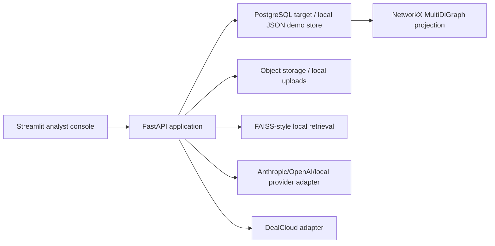

# IRIP Architecture

IRIP is organized as an internal analyst console backed by a service API.

The repository intentionally runs without external credentials. In local mode the platform uses a JSON
store and deterministic AI outputs. Production deployment should replace the store with PostgreSQL,
object storage, real provider credentials, and live DealCloud schema discovery.

## Modules

| Module | API | Primary value |
| --- | --- | --- |
| Meeting Intelligence | `POST /api/v1/meetings/extract` | Summary, action items, entities, CRM payload |
| Investor Research | `POST /api/v1/research/company` | Source-backed pre-meeting brief |
| CRM Autopilot | `POST /api/v1/crm/preflight`, `POST /api/v1/crm/sync` | Validation, dedupe, CSV/API-ready sync |
| Token Optimizer | `POST /api/v1/prompts/estimate`, `POST /api/v1/prompts/optimize` | Token, cost, routing, savings |
| Deliverables Generator | `POST /api/v1/deliverables/generate` | Follow-up email, FAQ, one-pager, pitch outline |
| Relationship Graph | `GET /api/v1/graph/all` | Company/contact/interaction edges |
| Knowledge Base | `POST /api/v1/ingest/document`, `POST /api/v1/rag/query` | Chunked upload search and citations |
| Dashboard | `GET /api/v1/dashboard/summary` | Operating metrics |

## Security Controls

- OAuth2 password flow with JWT access tokens.
- Demo scopes: `meeting:run`, `research:run`, `crm:sync`, `admin:config`.
- No raw transcript bodies are written to application logs.
- Uploaded source files are stored separately from derived summaries.
- CRM sync defaults to CSV export; live sync requires explicit credentials.
- LinkedIn scraping is intentionally excluded. Use analyst notes, approved exports, or licensed data.

## Production Upgrade Path

1. Replace `JsonStore` with PostgreSQL models and Alembic migrations.
2. Enable row-level security for transcripts, prompt runs, CRM payloads, and sensitive notes.
3. Store secrets in the deployment platform, not in database rows.
4. Add live DealCloud schema discovery, field mapping configuration, and OAuth2 token rotation.
5. Add background workers for document parsing, embedding refresh, and sync retries.
6. Add extraction evaluation fixtures and thresholds before using live CRM sync.
